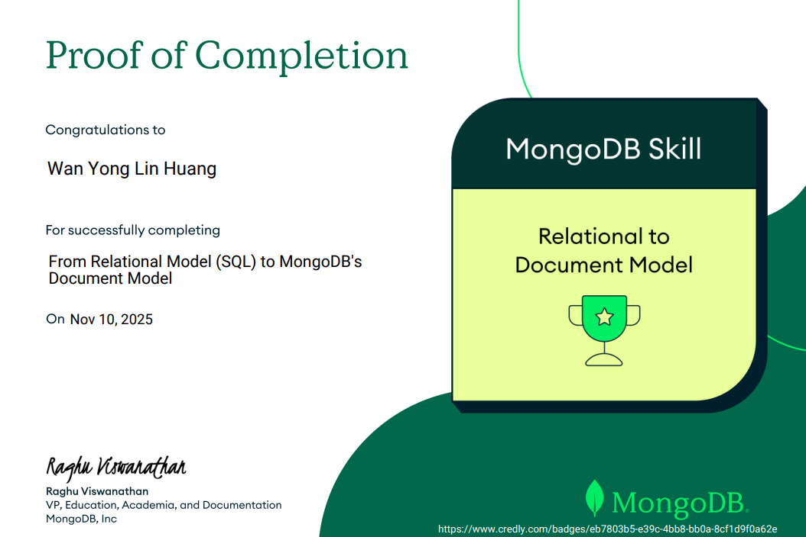

# MongoDB Basics
## MongoDB Overview

## Relational to Document Model

## Difference between a relational database and non-relational database
The main difference between the two types of databasese is that relational databases store data in tables with columns and rows while non-relational databases store data in documents with a json style. Another difference is that non-relational dbs utilize embedded and references while relational dbs rely on primary and foreign keys. 

## Healthcare-specific scenario where using non-SQL databases would be appropriate.
One such scenario will be when storing semi-structured data from physician notes and progress reports where it will be hard to store such data in tables. A flexible schema provided by non-SQL databases help store such semi-structured and unstructured data. 
